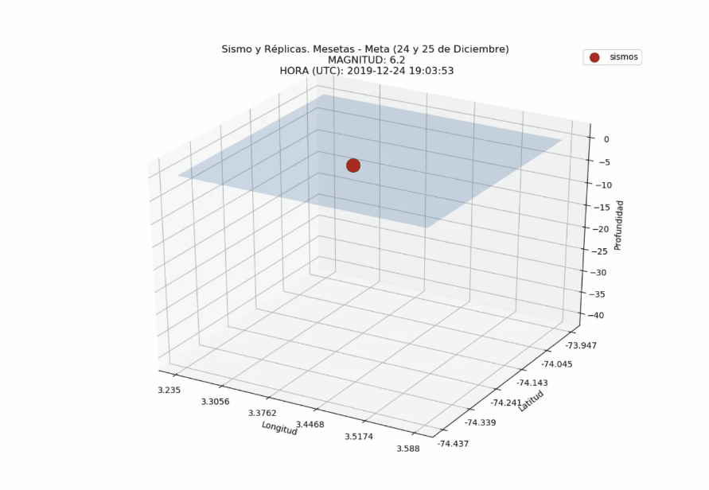

# sismos Mesetas, Meta (Diciembre 24 y 25 de 2019)

Un código para generar la visualización en 3D de los sismos en el evento telúrico del 24 de diciembre de 2019 y sus correspondientes réplicas.

### Importante: Crear una carpeta llamada imgs en donde se descarge el código, en esta carpeta se guardaran las imagenes generadas por el código visSismosimg.py serán leídas por el generador del video (generadorVid.py)

El video se genera en formato .avi, se recomienda editarlo con Movie Maker de windows para reducir su tamaño original alto (261 MB) a menos de 2MB
